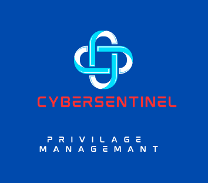
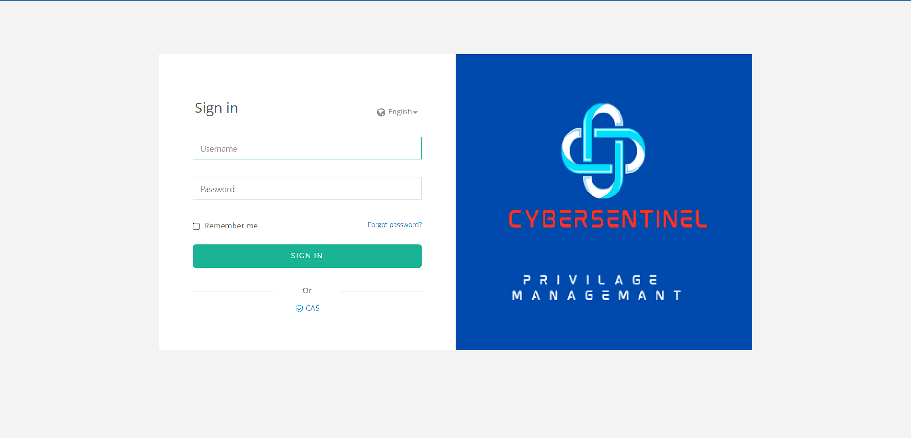
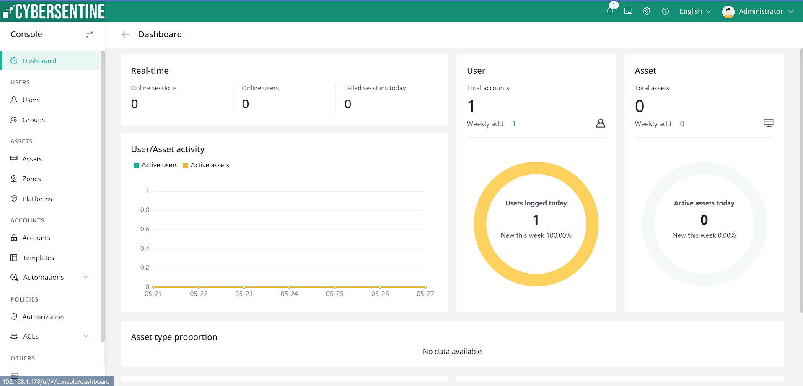
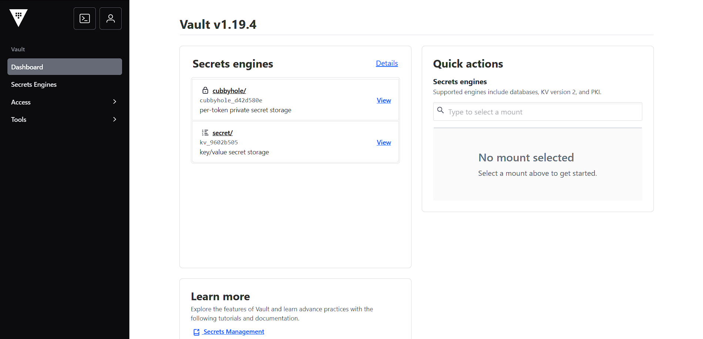
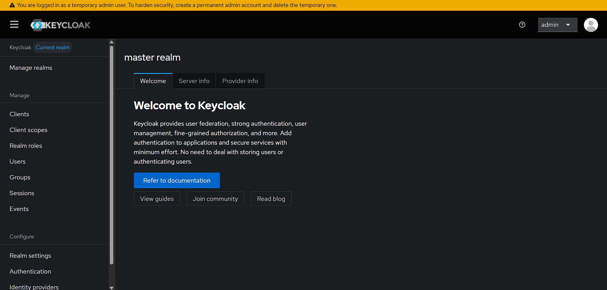
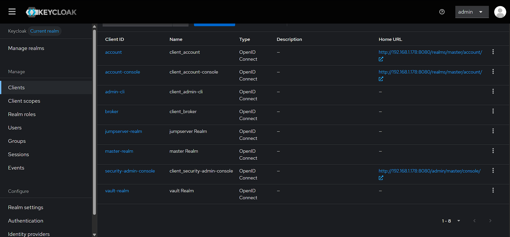

# SentinelEdge 🛡️

<div align="center">
  
  <br/>
  
</div>

<div align="center">

**A virtual security operations centre solution to detect & respond to cyber threats**

**Monitor, detect, analyse and respond to threats 24/7 and 365 days a year.**

[](LICENSE)
[](https://docker.com)
[](https://linux.org)

</div>

---

## 🎯 Overview

SentinelEdge is an integrated cybersecurity platform that provides comprehensive **PIM**, **PAM**, and **PUM** capabilities through three powerful services. This repository contains automated installation scripts that deploy a complete security operations centre in minutes.

### 🔧 Integrated Services

| Service | Component | Purpose | Port |
|---------|-----------|---------|------|
| **PIM** | CyberSentinel Vault | Privileged Identity Management - Secure secrets and sensitive data management | `8200` |
| **PAM** | CyberSentinel Asset Management | Privileged Access Management - Centralized access control and session management | `80`, `443`, `2222` |
| **PUM** | CyberSentinel Cloak | Privileged User Management - Identity authentication and authorization | `8080` |

---

## 🚀 Quick Installation


#### Install CyberSentinel Vault + Cloak (PIM + PUM)
```bash
curl -s -o install_vault_keycloak.sh https://raw.githubusercontent.com/Prajwal3112/SentinelEdge/main/install_vault_keycloak.sh && chmod +x install_vault_keycloak.sh && bash ./install_vault_keycloak.sh
```

#### Install CyberSentinel Asset Management (PAM)
```bash
curl -s -o install-jumpserver.sh https://raw.githubusercontent.com/Prajwal3112/SentinelEdge/main/install-jumpserver.sh && chmod +x install-jumpserver.sh && bash ./install-jumpserver.sh
```

#### Install PIM_PAM_PUM
```bash
curl -s -o install_all.sh https://raw.githubusercontent.com/Prajwal3112/SentinelEdge/main/install_all.sh && chmod +x install_all.sh && bash ./install_all.sh
```

## 📋 System Requirements

### Minimum Requirements

| Component | CyberSentinel Asset Management | CyberSentinel Vault + Cloak | Combined Total |
|-----------|-------------------------------|------------------------------|----------------|
| **CPU** | 4 cores | 4 cores | 4 cores |
| **Memory** | 8GB RAM | 8GB RAM | 16GB RAM |
| **Storage** | 50GB SSD | 30GB SSD | 80GB SSD |
| **OS** | Ubuntu 18.04+ / CentOS 7+ | Ubuntu 18.04+ / CentOS 7+ | Ubuntu 18.04+ / CentOS 7+ |
| **Docker** | Required | Required | Required |

### Network Requirements
- Internet connectivity for Docker image downloads
- Open ports as specified in the services table above
- Firewall configured to allow specified ports

---

## 🔐 Service Details

### CyberSentinel Vault (PIM)
**Privileged Identity Management**

CyberSentinel Vault provides enterprise-grade secrets management and privileged identity protection:

- **Secure Secret Storage**: Encrypted storage for API keys, passwords, certificates, and sensitive data
- **Dynamic Secrets**: Generate time-limited credentials for databases and cloud services
- **Access Policies**: Fine-grained access control with policy-based permissions
- **Audit Logging**: Comprehensive logging of all secret access and modifications
- **High Availability**: Clustering support for enterprise deployments

**Use Cases:**
- Storing and rotating database passwords
- Managing API keys and tokens
- Securing certificates and encryption keys
- Automating credential lifecycle management

### CyberSentinel Asset Management (PAM)
**Privileged Access Management**

CyberSentinel Asset Management delivers comprehensive privileged access control and session management:

- **Centralized Access Control**: Single point of access for all privileged operations
- **Session Recording**: Complete audit trail of privileged user sessions
- **Multi-Protocol Support**: SSH, RDP, VNC, and web-based access
- **Asset Discovery**: Automatic discovery and inventory of IT assets
- **Risk Assessment**: Real-time risk scoring and compliance monitoring

**Use Cases:**
- Managing server and database access
- Recording and auditing privileged sessions
- Implementing zero-trust access policies
- Compliance reporting and documentation

### CyberSentinel Cloak (PUM)
**Privileged User Management**

CyberSentinel Cloak provides advanced identity and access management capabilities:

- **Single Sign-On (SSO)**: Unified authentication across all security services
- **Multi-Factor Authentication**: Enhanced security with 2FA/MFA support
- **User Lifecycle Management**: Automated provisioning and deprovisioning
- **Role-Based Access Control**: Granular permissions based on user roles
- **Identity Federation**: Integration with existing directory services

**Use Cases:**
- Implementing SSO across security tools
- Managing user identities and permissions
- Enforcing multi-factor authentication
- Integrating with Active Directory/LDAP

---

## 🛠️ Management & Maintenance

### Uninstallation

#### Remove CyberSentinel Asset Management
```bash
curl -s -o uninstall-jumpserver.sh https://raw.githubusercontent.com/Prajwal3112/SentinelEdge/main/uninstall-jumpserver.sh && chmod +x uninstall-jumpserver.sh && bash ./uninstall-jumpserver.sh
```

#### Remove CyberSentinel Vault + Cloak
```bash
curl -s -o uninstall_vault_keycloak.sh https://raw.githubusercontent.com/Prajwal3112/SentinelEdge/main/uninstall_vault_keycloak.sh && chmod +x uninstall_vault_keycloak.sh && bash ./uninstall_vault_keycloak.sh
```

### Health Monitoring
All services include built-in health monitoring and status endpoints. Use the following commands to check service status:

```bash
# Check service status
docker ps | grep -E "(jms_|dev-vault|my-keycloak)"

# View service logs
docker logs <container_name>
```

---

## 🔄 Integration Status

| Integration | Status | Description |
|-------------|--------|-------------|
| **Vault ↔ Cloak** | ✅ **Active** | Fully integrated for seamless PIM/PUM operations |
| **Asset Management ↔ Vault** | 🔬 **R&D Phase** | Advanced integration under development |
| **Complete Suite Integration** | 🚧 **Coming Soon** | Full three-way integration in progress |

---

## 📞 Support & Contact

**Developer:** Prajwal Kamble  
**LinkedIn:** [https://www.linkedin.com/in/prajwal-kamble-642a4b222](https://www.linkedin.com/in/prajwal-kamble-642a4b222)

---

## 📜 License

This project is licensed under the MIT License - see the [LICENSE](LICENSE) file for details.

---

## 🎯 Why Choose CyberSentinel SentinelEdge?

- **🚀 Rapid Deployment**: From zero to fully operational security suite in minutes
- **🔒 Enterprise Security**: Bank-grade encryption and security controls
- **📊 Complete Visibility**: Comprehensive logging and audit trails
- **🔄 Seamless Integration**: Services designed to work together
- **💰 Cost-Effective**: Open-source foundation with enterprise features
- **🛡️ 24/7 Protection**: Continuous monitoring and threat detection

---

## 📸 Service Screenshots

### CyberSentinel Asset Management Dashboard



### CyberSentinel Vault Interface


### CyberSentinel Cloak Identity Management



---

<div align="center">

**🛡️ Secure Your Digital Infrastructure with CyberSentinel SentinelEdge 🛡️**

*Building tomorrow's cybersecurity solutions today*

</div>
